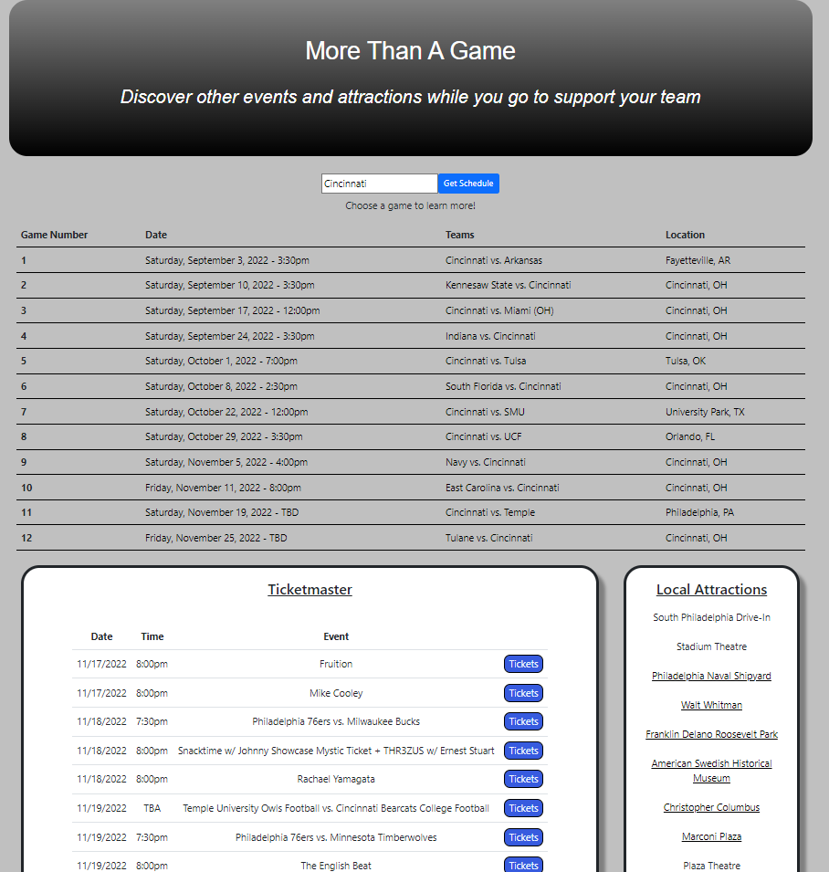

# More Than A Game

This collaboration between Destiny Ratsavong, Berekt Ashenafi, Julian Graves, and Michael Frabott is a concept that allows a user to search for their favorite college football team's schedule and subsequently populate local attractions in the city where the game is taking place and other sports and music events happening within a couple days of the game. Allowing the user to see what's going on aside from the game - they can plan a weekend full of activities all from one spot. 

This application utilizes three third=party APIs: CollegeFootballData API, Ticketmaster Discovery API, and openTripMap API. Due to authoriztion issues with the College Football Data API, the entire 2022 football season and stadium calls are stored locally and are not live to the API.

Once the initial pseudo-call is made to retrieve the user's selected team's schedule, they are afforded the opportunity to select any of the games on the schedule to initiate calls to the other APIs where they are presented with the relevant results.

## Installation and Usage

Using this application locally will require the progam to be run through a server as the CFB schedule and stadium calls are fetched locally and create CORS problems when run in the browser.

## Contributions

Additional API endpoints have already been identified and commented out to be added to the Local Attractions card, including images, which could be incorporated into the program. Additionally, user inputs could be added for Ticketmaster and OpenTripMap query parameters to cater to the user's specific preferences (currently 'music' and 'sports' are hardcoded into the TM call and 'cultural', 'historic', and 'natural' are queried in the OpenTripMap API. See https://opentripmap.io/catalog for alternative options the user could select). Other adjacent attractions would be welcome additions also.

## Screen Capture

## Deployed Link

https://mfrabott.github.io/More-Than-A-Game/

